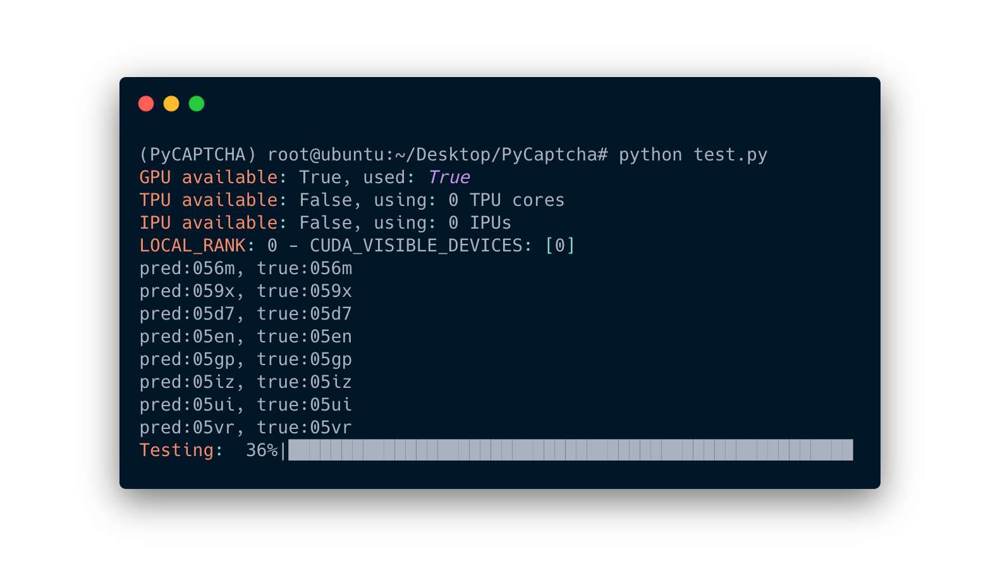

# PyCAPTCHA 🔍


---

**An End-to-end Pytorch-Lightning implemented CAPTCHA OCR model.**  
Training 2 epoch under 100k images to get over 96% acc on Val dataset 🤩  
> with 200k or even more training set you may get >98% acc




## INSTALL ⚙️
### Step0: Clone the Project
```shell
git clone https://github.com/ZiYang-xie/PyCAPTCHA
cd PyCAPTCHA
```

### Step1: Create & Activate Conda Env
```shell
conda create -n "PyCaptcha" python=3.7
conda activate PyCaptcha
```

### Step2: Install Pytorch 
```shell
conda install torch==1.9.0 torchvision==0.10.0 -c pytorch
```

### Step3: Install PIP Requirements 
```shell
pip install -r requirement.txt
```

## Docment 📃
> Checkout the PyCAPTCHA Usage in WIKI Page
  
Check the [Doc](https://github.com/ZiYang-xie/PyCAPTCHA/wiki)
